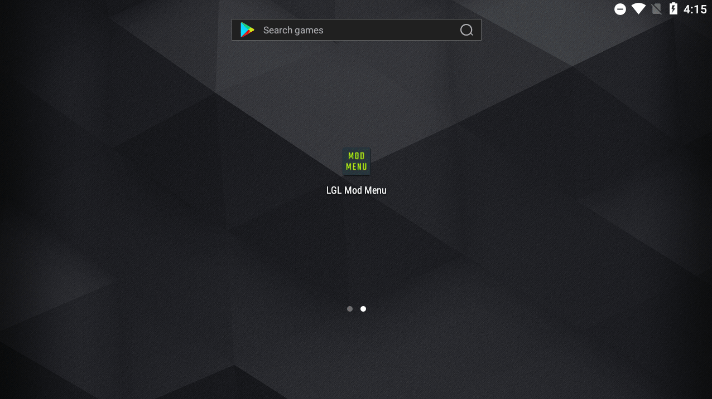

# Android Mod Menu — Modernized Fork

> A modern and advanced fork of the legendary LGLTeam's Android Mod Menu — updated for relevance, cleaned for clarity, and maintained under the MIT License. Credits to the original author whose legacy lives on.

---

## 📢 Project Status

This project is a continuation and modernization of the original Android Mod Menu by LGLTeam.  
As of November 1, 2024, the original author has officially ceased development and deleted their GitHub and Telegram accounts due to personal reasons and a departure from the Android modding scene.

The LGL Team Telegram channel remains available and is currently managed by [Spring Musk](https://t.me/Layout_musk).

---

## 📦 Features

- Floating mod menu for `il2cpp` and native Android games
- Built-in support for:
  - KittyMemory
  - Cydia Substrate
  - And64InlineHook
  - AES string obfuscator
- Embedded assets via base64 (no asset folder required)
- ARMv7 and ARM64 architecture support
- Compatible from Android 4.4 (KitKat) to Android 15

---

## 🎯 Purpose of This Fork

- Preserve a high-quality legacy modding framework
- Improve code structure and bring it in line with modern standards
- Maintain an open-source, community-driven mod menu base
- Enable easier contribution and customization by new developers

---

## 🧰 Getting Started

Refer to the `Docs/` directory for setup instructions, integration examples, and technical documentation.

---

## 💡 Need Support?

This project does not provide support for game-specific modding, offsets, or debugging.  
For hooking issues or crashes, please consult general Android reverse engineering forums or communities.

---

## 🙏 Credits

We acknowledge and thank all contributors and source authors whose work made this project possible:

- **Octowolve / Escanor** – Base mod menu and hooking examples  
  https://github.com/z3r0Sec/Substrate-Template-With-Mod-Menu  
  https://github.com/z3r0Sec/Substrate-Hooking-Example
- **VanHoevenTR** – UI design and implementation  
- **MrIkso** – Original floating menu concept  
- **MJx0 (Ruit)** – [KittyMemory](https://github.com/MJx0/KittyMemory)  
- **Rprop** – [And64InlineHook](https://github.com/Rprop/And64InlineHook)  
- And others who contributed valuable insights and code.

Special thanks to the original developer of this project — though their online presence is gone, the value of their work remains.

---

## 🎥 Attribution for Video Creators

If you create a video featuring this project, whether for tutorials, gameplay, or any other content, **please credit @ZNFDev** and include a link to the [official GitHub repository](https://github.com/ZNFDev/Android-Modern-Mod-Menu) in your video description.

Failure to provide proper credit is a violation of the MIT License, and we reserve the right to take appropriate action, including issuing a **DMCA Takedown** request if necessary. We appreciate your understanding and respect for the original work.

---

## 📜 License

This project is distributed under the [MIT License](./LICENSE).  
Attribution is required for any redistribution, modification, or derivative use.

---

## ⚠️ Disclaimer

This project is for **educational purposes only**.  
We do **not support cheating in online or multiplayer games**.

Do **not** use this tool on protected or competitive games or others owned by Tencent.  
This source code is and always will be **free** — do not purchase it or trust paid resellers.

---